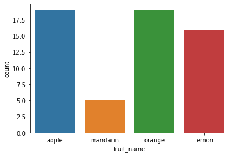
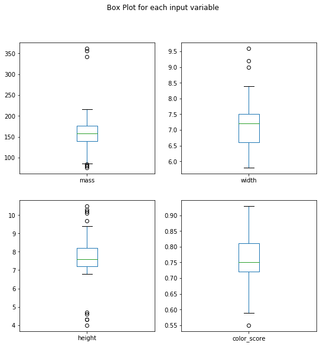
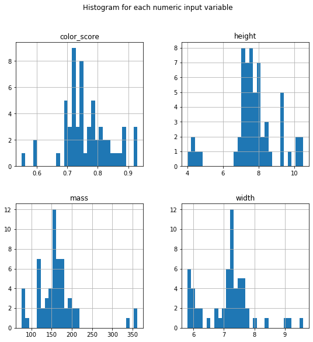
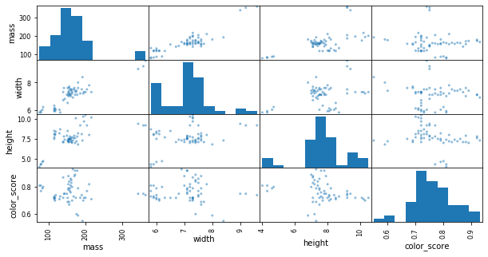
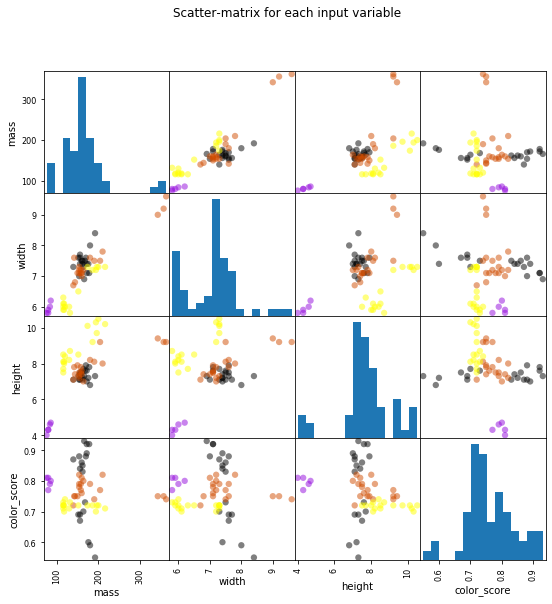

######Detalhes do projeto
[Codigo e descrição do projeto](https://towardsdatascience.com/solving-a-simple-classification-problem-with-python-fruits-lovers-edition-d20ab6b071d2)

######Download
[Fruits Dataset](https://raw.githubusercontent.com/susanli2016/Machine-Learning-with-Python/master/fruit_data_with_colors.txt)

###### Nesse exemplo iremos utilizar as bibliotecas numpy, pandas, matplotlib, seaborn


[numpy](https://numpy.org/devdocs/)
[pandas](https://pandas.pydata.org/pandas-docs/stable/reference/io.html)
[matplotlib.pyplot](https://matplotlib.org/3.2.1/api/_as_gen/matplotlib.pyplot.html) 
[seaborn](https://seaborn.pydata.org/api.html)


#### Importando as bibliotecas que iremos utilizar


```python
import numpy as np
import pandas as pd
import matplotlib.pyplot as plt
```

#### Identificando os dados e vendo o cabeçalho


```python
fruits = pd.read_table('fruit_data_with_colors.txt')
fruits.head()
```


<div>
<style scoped>
    .dataframe tbody tr th:only-of-type {
        vertical-align: middle;
    }

    .dataframe tbody tr th {
        vertical-align: top;
    }

    .dataframe thead th {
        text-align: right;
    }
</style>
<table border="1" class="dataframe">
  <thead>
    <tr style="text-align: right;">
      <th></th>
      <th>fruit_label</th>
      <th>fruit_name</th>
      <th>fruit_subtype</th>
      <th>mass</th>
      <th>width</th>
      <th>height</th>
      <th>color_score</th>
    </tr>
  </thead>
  <tbody>
    <tr>
      <th>0</th>
      <td>1</td>
      <td>apple</td>
      <td>granny_smith</td>
      <td>192</td>
      <td>8.4</td>
      <td>7.3</td>
      <td>0.55</td>
    </tr>
    <tr>
      <th>1</th>
      <td>1</td>
      <td>apple</td>
      <td>granny_smith</td>
      <td>180</td>
      <td>8.0</td>
      <td>6.8</td>
      <td>0.59</td>
    </tr>
    <tr>
      <th>2</th>
      <td>1</td>
      <td>apple</td>
      <td>granny_smith</td>
      <td>176</td>
      <td>7.4</td>
      <td>7.2</td>
      <td>0.60</td>
    </tr>
    <tr>
      <th>3</th>
      <td>2</td>
      <td>mandarin</td>
      <td>mandarin</td>
      <td>86</td>
      <td>6.2</td>
      <td>4.7</td>
      <td>0.80</td>
    </tr>
    <tr>
      <th>4</th>
      <td>2</td>
      <td>mandarin</td>
      <td>mandarin</td>
      <td>84</td>
      <td>6.0</td>
      <td>4.6</td>
      <td>0.79</td>
    </tr>
  </tbody>
</table>
</div>


#### Identificando os dados e vendo as ultimas linhas


```python
fruits.tail()
```


<div>
<style scoped>
    .dataframe tbody tr th:only-of-type {
        vertical-align: middle;
    }

    .dataframe tbody tr th {
        vertical-align: top;
    }

    .dataframe thead th {
        text-align: right;
    }
</style>
<table border="1" class="dataframe">
  <thead>
    <tr style="text-align: right;">
      <th></th>
      <th>fruit_label</th>
      <th>fruit_name</th>
      <th>fruit_subtype</th>
      <th>mass</th>
      <th>width</th>
      <th>height</th>
      <th>color_score</th>
    </tr>
  </thead>
  <tbody>
    <tr>
      <th>54</th>
      <td>4</td>
      <td>lemon</td>
      <td>unknown</td>
      <td>116</td>
      <td>6.1</td>
      <td>8.5</td>
      <td>0.71</td>
    </tr>
    <tr>
      <th>55</th>
      <td>4</td>
      <td>lemon</td>
      <td>unknown</td>
      <td>116</td>
      <td>6.3</td>
      <td>7.7</td>
      <td>0.72</td>
    </tr>
    <tr>
      <th>56</th>
      <td>4</td>
      <td>lemon</td>
      <td>unknown</td>
      <td>116</td>
      <td>5.9</td>
      <td>8.1</td>
      <td>0.73</td>
    </tr>
    <tr>
      <th>57</th>
      <td>4</td>
      <td>lemon</td>
      <td>unknown</td>
      <td>152</td>
      <td>6.5</td>
      <td>8.5</td>
      <td>0.72</td>
    </tr>
    <tr>
      <th>58</th>
      <td>4</td>
      <td>lemon</td>
      <td>unknown</td>
      <td>118</td>
      <td>6.1</td>
      <td>8.1</td>
      <td>0.70</td>
    </tr>
  </tbody>
</table>
</div>


#### Print da coluna fruit_name da datase dataset fruits 


```python
print(fruits['fruit_name'].unique())
```

    ['apple' 'mandarin' 'orange' 'lemon']


#### Print da quantidade de linhas e colunas da dataset fruits(tuplas)


```python
print(fruits.shape)
```

    (59, 7)


#### Descrição de propriedades estatísticas da amostra


```python
fruits.describe()
```


<div>
<style scoped>
    .dataframe tbody tr th:only-of-type {
        vertical-align: middle;
    }

    .dataframe tbody tr th {
        vertical-align: top;
    }

    .dataframe thead th {
        text-align: right;
    }
</style>
<table border="1" class="dataframe">
  <thead>
    <tr style="text-align: right;">
      <th></th>
      <th>fruit_label</th>
      <th>mass</th>
      <th>width</th>
      <th>height</th>
      <th>color_score</th>
    </tr>
  </thead>
  <tbody>
    <tr>
      <th>count</th>
      <td>59.000000</td>
      <td>59.000000</td>
      <td>59.000000</td>
      <td>59.000000</td>
      <td>59.000000</td>
    </tr>
    <tr>
      <th>mean</th>
      <td>2.542373</td>
      <td>163.118644</td>
      <td>7.105085</td>
      <td>7.693220</td>
      <td>0.762881</td>
    </tr>
    <tr>
      <th>std</th>
      <td>1.208048</td>
      <td>55.018832</td>
      <td>0.816938</td>
      <td>1.361017</td>
      <td>0.076857</td>
    </tr>
    <tr>
      <th>min</th>
      <td>1.000000</td>
      <td>76.000000</td>
      <td>5.800000</td>
      <td>4.000000</td>
      <td>0.550000</td>
    </tr>
    <tr>
      <th>25%</th>
      <td>1.000000</td>
      <td>140.000000</td>
      <td>6.600000</td>
      <td>7.200000</td>
      <td>0.720000</td>
    </tr>
    <tr>
      <th>50%</th>
      <td>3.000000</td>
      <td>158.000000</td>
      <td>7.200000</td>
      <td>7.600000</td>
      <td>0.750000</td>
    </tr>
    <tr>
      <th>75%</th>
      <td>4.000000</td>
      <td>177.000000</td>
      <td>7.500000</td>
      <td>8.200000</td>
      <td>0.810000</td>
    </tr>
    <tr>
      <th>max</th>
      <td>4.000000</td>
      <td>362.000000</td>
      <td>9.600000</td>
      <td>10.500000</td>
      <td>0.930000</td>
    </tr>
  </tbody>
</table>
</div>


#### Agrupando a tupla fruits pelo campo fruit_name e trazendo a quantidade de cada um


```python
print(fruits.groupby('fruit_name').size())
```

    fruit_name
    apple       19
    lemon       16
    mandarin     5
    orange      19
    dtype: int64


#### Testando a funcionalidade do group by size


```python
print(fruits.groupby('fruit_subtype').size())
```

    fruit_subtype
    braeburn             5
    cripps_pink          6
    golden_delicious     5
    granny_smith         3
    mandarin             5
    selected_seconds     6
    spanish_belsan       6
    spanish_jumbo        3
    turkey_navel        10
    unknown             10
    dtype: int64


#### Plotando os meus dados por Fruits name x Contagem


```python
import seaborn as sns
sns.countplot(fruits['fruit_name'],label="Count")
plt.show()

```





```python
fruits.drop('fruit_label', axis=1).plot(kind='box', subplots=True, layout=(2,2), sharex=False, sharey=False, figsize=(9,9), 
                                        title='Box Plot for each input variable')
plt.savefig('fruits_boxplot')
plt.show()
```





#### Criando gráfico histograma para cada valor de entrada numérico
http://www.portalaction.com.br/estatistica-basica/17-histograma


```python
import pylab as pl
fruits.drop('fruit_label' ,axis=1).hist(bins=30, figsize=(9,9))
pl.suptitle("Histogram for each numeric input variable")
plt.savefig('fruits_hist')
plt.show()
```





```python

```

#### Criando minha matriz de dispersão

https://support.minitab.com/pt-br/minitab/19/help-and-how-to/graphs/matrix-plot/before-you-start/overview/

https://support.minitab.com/pt-br/minitab/18/help-and-how-to/graphs/how-to/matrix-plot/interpret-the-results/key-results/


```python
from pandas.plotting import scatter_matrix
```


```python
scatter_matrix(fruits.drop('fruit_label', axis=1), figsize=(10, 5))
plt.show()
```





```python
from matplotlib import cm

cmap = cm.get_cmap('gnuplot')
scatter_matrix(X, c = y, marker = 'o', s=40, hist_kwds={'bins':15}, figsize=(9,9), cmap = cmap)
plt.suptitle('Scatter-matrix for each input variable')
plt.savefig('fruits_scatter_matrix')
```





#### Treinando modelos - Regressão logística, vizinho mais próximo, árvore de decisão


```python

from sklearn.model_selection import train_test_split

X_train, X_test, y_train, y_test = train_test_split(X, y, random_state=0)
```

Nessa imagem vemos que há uma correlação entre massa e largura


```python
feature_names = ['mass', 'width', 'height', 'color_score']
X = fruits[feature_names]
y = fruits['fruit_label']
```


```python

from sklearn.preprocessing import MinMaxScaler
scaler = MinMaxScaler()
X_train = scaler.fit_transform(X_train)
X_test = scaler.transform(X_test)
```


```python

from sklearn.linear_model import LogisticRegression

logreg = LogisticRegression()
logreg.fit(X_train, y_train)

print('Accuracy of Logistic regression classifier on training set: {:.2f}'
     .format(logreg.score(X_train, y_train)))
print('Accuracy of Logistic regression classifier on test set: {:.2f}'
     .format(logreg.score(X_test, y_test)))
```

    Accuracy of Logistic regression classifier on training set: 0.75
    Accuracy of Logistic regression classifier on test set: 0.47


```python
from sklearn.tree import DecisionTreeClassifier

clf = DecisionTreeClassifier().fit(X_train, y_train)

print('Accuracy of Decision Tree classifier on training set: {:.2f}'
     .format(clf.score(X_train, y_train)))
print('Accuracy of Decision Tree classifier on test set: {:.2f}'
     .format(clf.score(X_test, y_test)))
```

    Accuracy of Decision Tree classifier on training set: 1.00
    Accuracy of Decision Tree classifier on test set: 0.73


```python

clf2 = DecisionTreeClassifier(max_depth=3).fit(X_train, y_train)
print('Accuracy of Decision Tree classifier on training set: {:.2f}'
     .format(clf2.score(X_train, y_train)))
print('Accuracy of Decision Tree classifier on test set: {:.2f}'
     .format(clf2.score(X_test, y_test)))
```

    Accuracy of Decision Tree classifier on training set: 0.89
    Accuracy of Decision Tree classifier on test set: 0.73


```python
from sklearn.neighbors import KNeighborsClassifier

knn = KNeighborsClassifier()
knn.fit(X_train, y_train)
print('Accuracy of K-NN classifier on training set: {:.2f}'
     .format(knn.score(X_train, y_train)))
print('Accuracy of K-NN classifier on test set: {:.2f}'
     .format(knn.score(X_test, y_test)))
```

    Accuracy of K-NN classifier on training set: 0.95
    Accuracy of K-NN classifier on test set: 1.00


```python
from sklearn.discriminant_analysis import LinearDiscriminantAnalysis

lda = LinearDiscriminantAnalysis()
lda.fit(X_train, y_train)
print('Accuracy of LDA classifier on training set: {:.2f}'
     .format(lda.score(X_train, y_train)))
print('Accuracy of LDA classifier on test set: {:.2f}'
     .format(lda.score(X_test, y_test)))
```

    Accuracy of LDA classifier on training set: 0.86
    Accuracy of LDA classifier on test set: 0.67


```python
from sklearn.naive_bayes import GaussianNB

gnb = GaussianNB()
gnb.fit(X_train, y_train)
print('Accuracy of GNB classifier on training set: {:.2f}'
     .format(gnb.score(X_train, y_train)))
print('Accuracy of GNB classifier on test set: {:.2f}'
     .format(gnb.score(X_test, y_test)))
```

    Accuracy of GNB classifier on training set: 0.86
    Accuracy of GNB classifier on test set: 0.67


```python

```


```python

```
